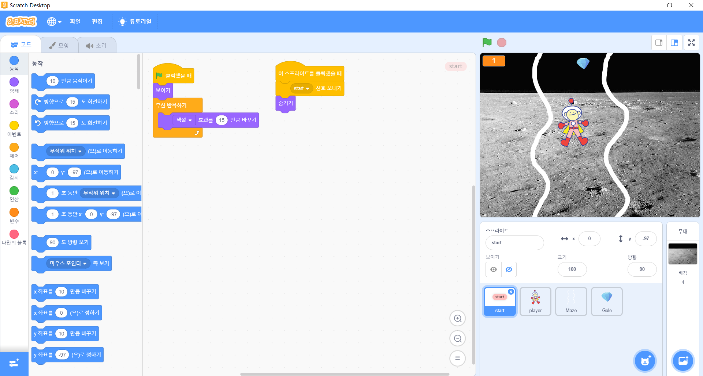
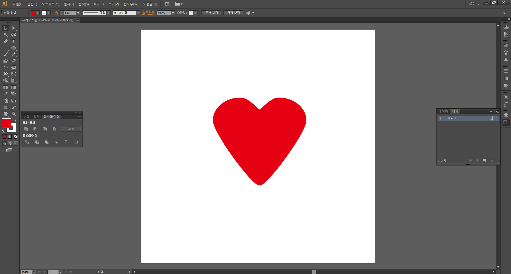
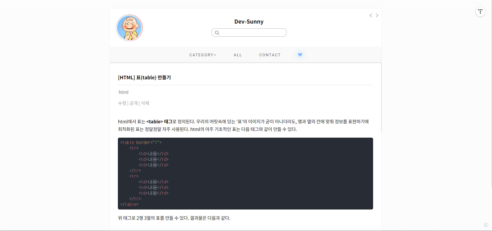
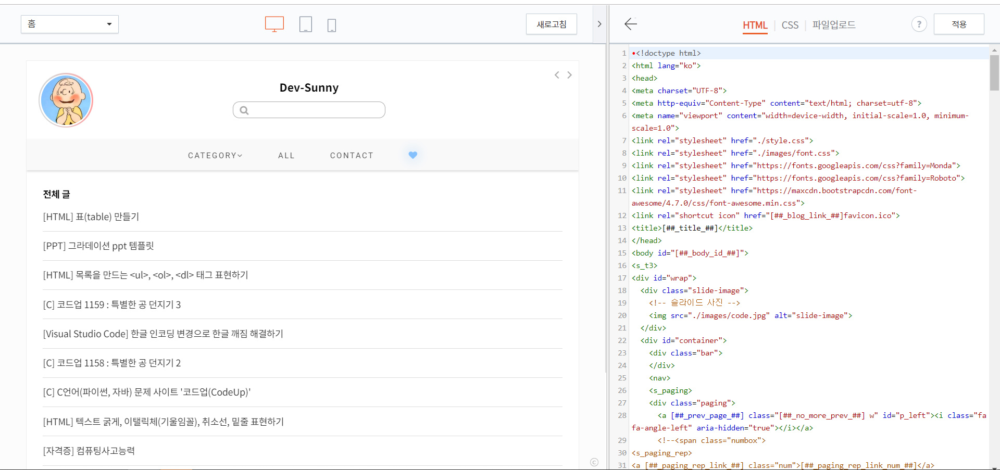
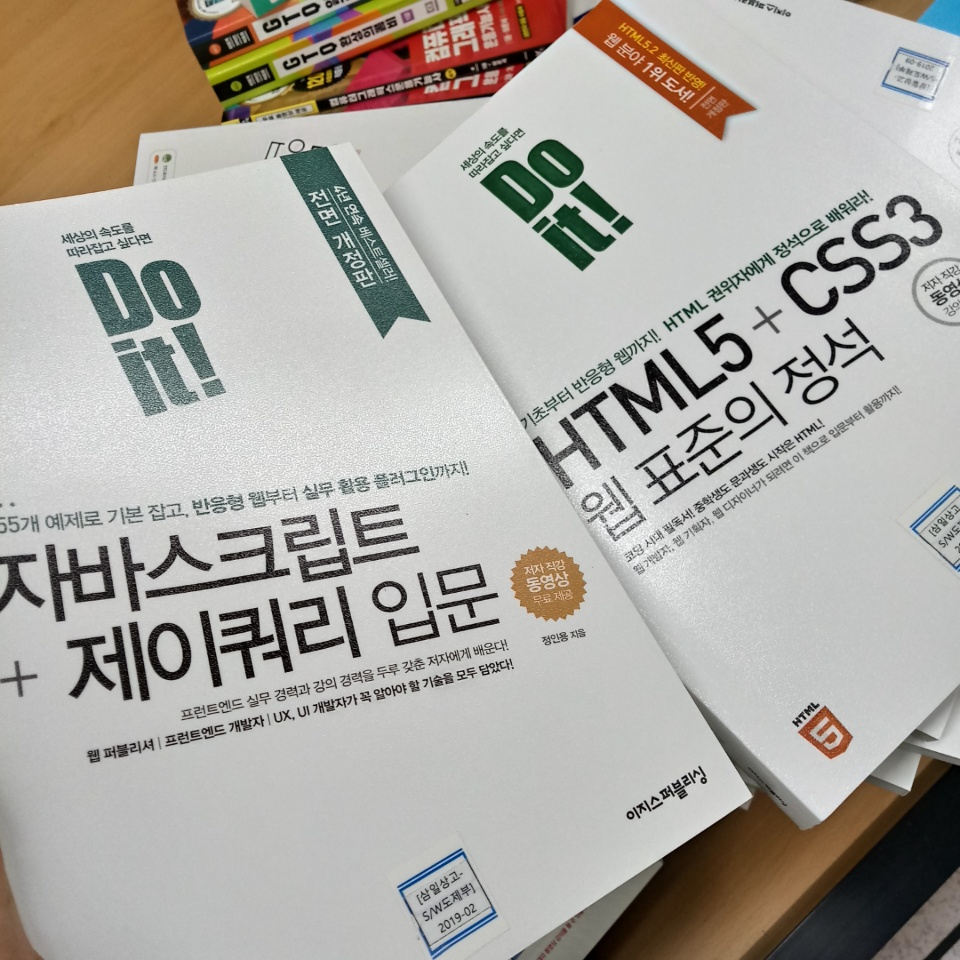
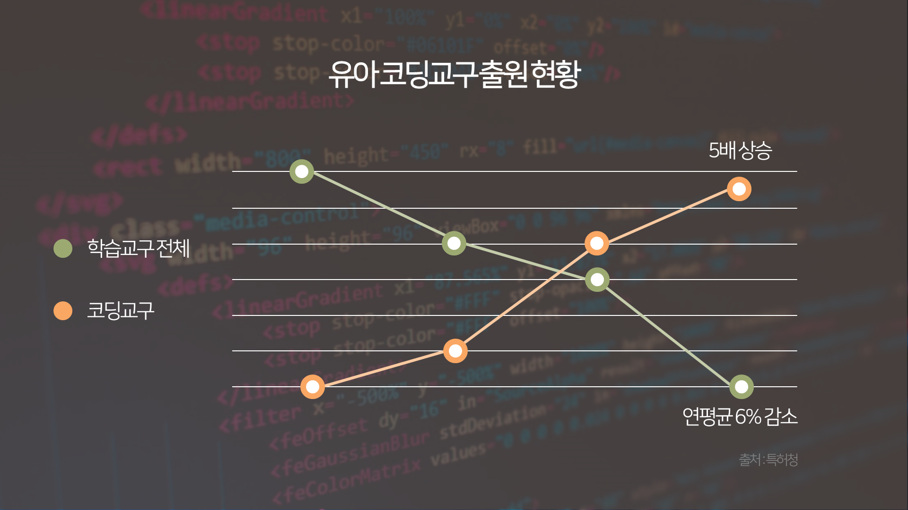
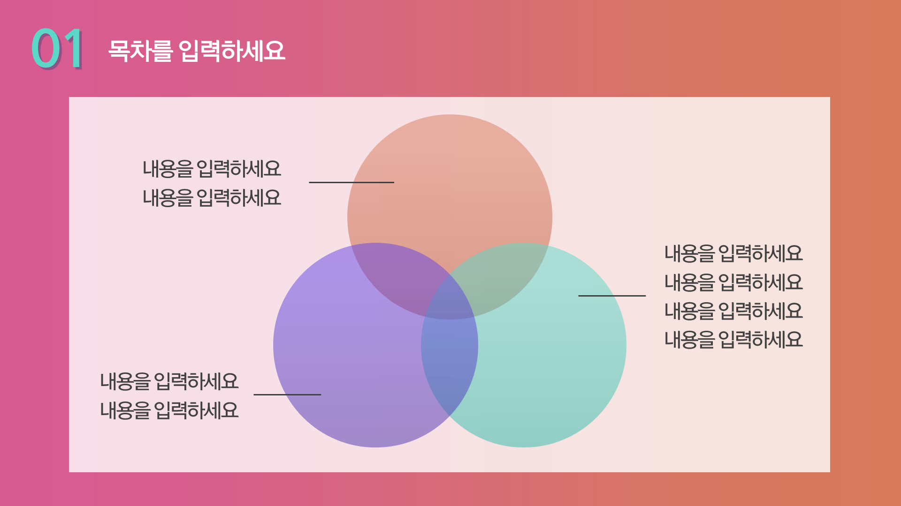

> ## 여름방학

방학 동안 학교에서 보충 수업을 들었다. 스크래치를 이용한 컴퓨터사고능력 자격증 공부와 GTQ 일러스트레이터 공부도 했다.

스크래치로 만든 간단한 게임이다. 스크래치는 한 번도 해본 적 없었는데 여름방학에 처음으로 스크래치를 해보았다.

GTQ 일러스트레이터도 공부했다.

티스토리도 시작했다. html과 css를 공부하면서 정보를 올리는 블로그로 만드려고 했는데 블로그 포스팅하는 게 쉬운 일이 아니었다. 인터넷에 공개된 티스토리 테마 소스를 조금 수정해서 적용했다.

학교에서 개발 관련 서적을 많이 구매해줘서 이 책을 읽으면서 티스토리에 글을 올렸다.

ppt 디자인하는 게 재밌어서 개발 외적인 거지만 방학 동안 ppt도 만들었다.